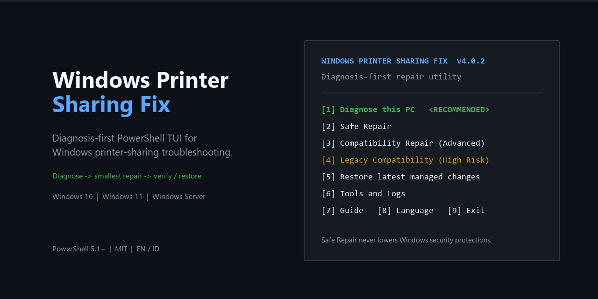

# Windows Printer Sharing Fix

<p align="center">
  
</p>

<p align="center">
  <a href="https://github.com/man612/Windows-Printer-Sharing-Fix/releases/latest"></a>
  <a href="https://github.com/man612/Windows-Printer-Sharing-Fix/actions/workflows/validate.yml"></a>
  
  <a href="LICENSE"></a>
  <a href="https://github.com/man612/Windows-Printer-Sharing-Fix/stargazers"></a>
</p>

<p align="center"><strong>English</strong> · <a href="docs/README.id.md">Bahasa Indonesia</a></p>

A diagnosis-first PowerShell TUI for troubleshooting **Windows shared printers** without applying broad security downgrades by default.

It inspects the actual failure layer first — Spooler, network profile, SMB/RPC reachability, Windows Protected Print, Point and Print policy, printer drivers, or legacy compatibility — then exposes the smallest relevant repair. It is useful when troubleshooting shared-printer failures commonly associated with errors such as `0x0000011b`, `0x00000709`, and `0x00000bc4`, although an error code alone is never treated as proof of a specific fix.

> **Stable interface:** the dependency-free Windows PowerShell TUI launched by `FixPrinter.bat`. The experimental OpenTUI frontend is not part of stable releases.

## Quick start

**Recommended:** use the packaged ZIP from the latest GitHub Release.

1. Open the [latest release](https://github.com/man612/Windows-Printer-Sharing-Fix/releases/latest).
2. Download `Windows-Printer-Sharing-Fix-vX.Y.Z.zip` and extract it.
3. Double-click `FixPrinter.bat`.
4. Accept the Administrator prompt.
5. Choose **Diagnose this PC** first.
6. Escalate to Safe, Advanced, or Legacy repair only when the diagnosis points there.

Or clone the repository:

```powershell
git clone https://github.com/man612/Windows-Printer-Sharing-Fix.git
cd Windows-Printer-Sharing-Fix
.\FixPrinter.bat
```

No installer is required. Windows PowerShell 5.1 is the compatibility baseline.

## What makes v4 different

| Principle | Stable v4 behavior |
| --- | --- |
| Diagnose before changing | Reads Windows/printer/network state before suggesting compatibility workarounds. |
| Smallest relevant repair | Safe actions are isolated instead of bundled into a broad “Full Fix”. |
| Security downgrades are explicit | RPC privacy, SMB1, guest auth, and LAN Manager fallbacks live outside Safe Repair. |
| Restore is scoped | Managed changes snapshot only the state relevant to that action. |
| Legacy stays legacy | Old compatibility options are available, but they are never treated as the default baseline. |

## Stable TUI

```text
==============================================================================
  WINDOWS PRINTER SHARING FIX  v4.0.2
  Diagnosis-first repair utility
  > MAIN MENU
==============================================================================
  OS: Windows 11 build 26100    Language: EN    Spooler: Running
------------------------------------------------------------------------------
  START HERE
[1] Diagnose this PC  <RECOMMENDED>

  REPAIR
[2] Safe Repair
[3] Compatibility Repair (Advanced)
[4] Legacy Compatibility (High Risk)

  SUPPORT
[5] Restore latest managed changes
[6] Tools and Logs
[7] Guide
[8] Language
[9] Exit
------------------------------------------------------------------------------
```

The stable UI intentionally uses normal Windows PowerShell console primitives. It is lightweight, inspectable, and does not require a TUI framework, Node.js, Bun, or .NET package installation.

## What Diagnose checks

The local diagnosis is read-only and currently inspects:

- Windows product, build, and PowerShell version.
- Print Spooler state and installed printer inventory.
- Shared-printer host / network-printer client role.
- Active network profiles.
- Windows Protected Print (WPP) indicators.
- RPC printer policy, including Named Pipes compatibility state.
- Point and Print driver-installation protection.
- SMB1 client and insecure guest-auth state.
- LAN Manager compatibility and blank-password restrictions.
- Recent PrintService Admin warnings/errors.

For a specific `\\HOST\Printer` path, the optional target test checks name resolution, TCP 445/SMB, TCP 135/RPC Endpoint Mapper, the host share namespace, and whether the printer is already connected locally.

## Repair tiers

| Tier | Intended use | Examples |
| --- | --- | --- |
| **Safe Repair** | First-line repair without lowering printer/network security protections. | Restart Spooler, clear a stuck queue, enable built-in sharing firewall rules for Private/Domain, start discovery services, change one selected network to Private. |
| **Compatibility** | Targeted workaround after diagnosis provides evidence. | Role-aware RPC Named Pipes fallback, temporary Point and Print relaxation, WPP guidance, targeted printer-connection reset. |
| **Legacy** | Last resort for proven old-device requirements. | SMB1 client, insecure SMB guest, LAN Manager compatibility level 1. |

High-risk actions require explicit typed confirmation. The utility intentionally refuses to automate remote blank-password logon.

## Safety boundaries

Safe Repair is statically guarded from adding these behaviors:

- `RpcAuthnLevelPrivacyEnabled=0`.
- permanent `RestrictDriverInstallationToAdministrators=0`.
- SMB1 or insecure guest authentication.
- LAN Manager authentication downgrade.
- `LimitBlankPasswordUse=0`.
- broad Client Side Rendering Print Provider deletion.

Point and Print relaxation, when explicitly selected, is temporary around one connection attempt and restores its previous value in `finally`.

## Validation

GitHub Actions runs on Windows with Windows PowerShell 5.1 and checks:

- syntax and static security invariants;
- diagnosis-only execution with a before/after managed-state fingerprint;
- English/Indonesian localization output;
- migration of legacy language/restore state to the external runtime workspace;
- the end-user release ZIP and SHA256 checksum.

CI is a guardrail, not a substitute for real printer hardware and host/client testing. The broader lab plan is tracked in [docs/TEST-MATRIX.md](docs/TEST-MATRIX.md).

## Data, logs, and privacy

Windows Printer Sharing Fix does not include telemetry or automatic report upload.

Starting with v4.0.2, runtime state is stored outside the repository under:

```text
%LOCALAPPDATA%\WindowsPrinterSharingFix\
|-- backups\
|-- logs\
|-- language.cfg
```

This keeps a Git clone clean when you change language or run diagnostics. Existing v4 backup state and language preference from the old repository-local layout are migrated on first run when possible. Set `WPSF_DATA_ROOT` before launch only if you intentionally need a custom runtime-data location.

## Windows support

| Platform | Status |
| --- | --- |
| Windows 11 | Primary target. |
| Windows 10 + PowerShell 5.1 | Supported on a best-effort basis; keep the OS fully patched / use eligible ESU where applicable. |
| Windows Server 2022 / 2025 | Diagnosis and repair paths are supported where the same Windows printing/network cmdlets exist; real printer environments can still differ by policy. |
| Windows 7 / 8 / 8.1 | Legacy best effort only; some modern cmdlets and protections do not exist. |

The project deliberately distinguishes Windows Server from Windows 11 even when they share a build family.

## Documentation

- [Quick start](docs/QUICKSTART.md)
- [Architecture](docs/ARCHITECTURE.md)
- [Real-world test matrix](docs/TEST-MATRIX.md)
- [Security policy](SECURITY.md)
- [Contributing](CONTRIBUTING.md)
- [Roadmap](ROADMAP.md)
- [Changelog](CHANGELOG.md)

## Contributing

Bug reports, compatibility findings, documentation improvements, and focused code changes are welcome.

Before opening a bug, run **Diagnose this PC** and include the relevant output with hostnames, usernames, credentials, and other sensitive details redacted. New contributors can look for issues labeled `good first issue` or `help wanted`.

Pull requests should explain the real-world failure scenario, what Windows state changes, the security/compatibility trade-off, how the change is tested, and how it can be restored. See [CONTRIBUTING.md](CONTRIBUTING.md).

## Experimental UI work

A modern OpenTUI frontend is being explored separately in [draft PR #2](https://github.com/man612/Windows-Printer-Sharing-Fix/pull/2). It is intentionally **not** the recommended interface and is not included in stable release packages.

## Support and discussion

- [Report a bug or compatibility problem](https://github.com/man612/Windows-Printer-Sharing-Fix/issues/new/choose)
- [Ask a question or share a working setup](https://github.com/man612/Windows-Printer-Sharing-Fix/discussions)
- For a security vulnerability, follow [SECURITY.md](SECURITY.md) instead of opening a public exploit report.

## FAQ

**Does Diagnose change Windows settings?**

No. The diagnosis path is tested against a managed-state fingerprint and must remain read-only.

**Why not provide one big “fix everything” button?**

Printer sharing failures can come from unrelated layers. Stacking security and registry changes can hide the real cause and make rollback harder.

**Where are backups and logs?**

Use **Tools and Logs** in the TUI, or open `%LOCALAPPDATA%\WindowsPrinterSharingFix`.

**Is this an official Microsoft tool?**

No. It is an independent open-source troubleshooting utility.

If the project saves you time, a GitHub star helps other Windows users and sysadmins discover it.

## License

MIT. See [LICENSE](LICENSE).
